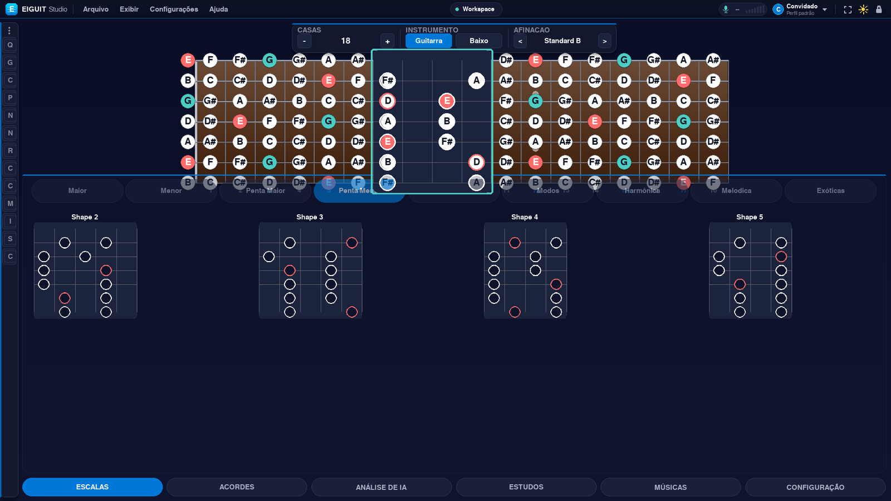
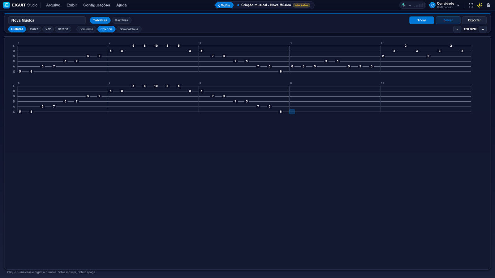
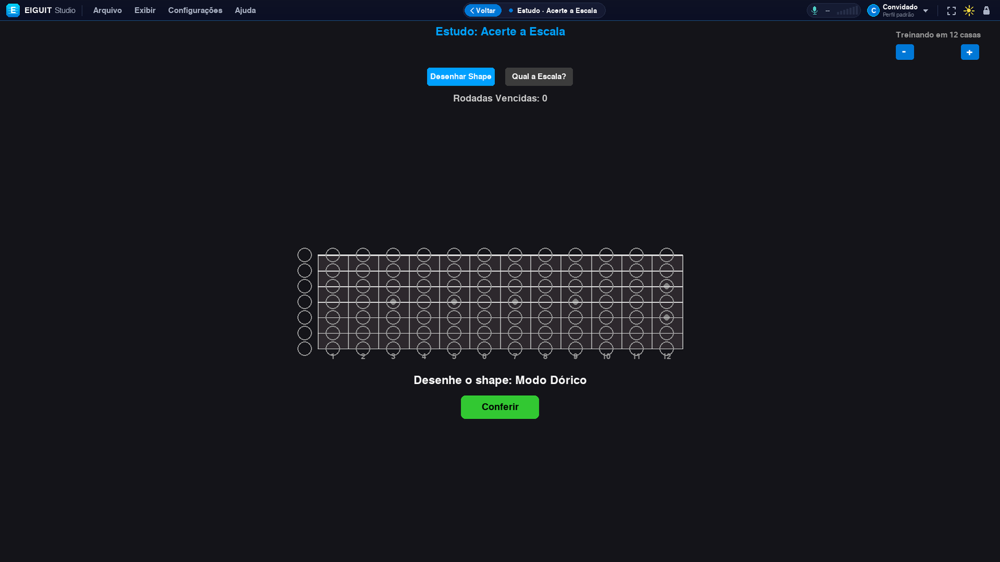
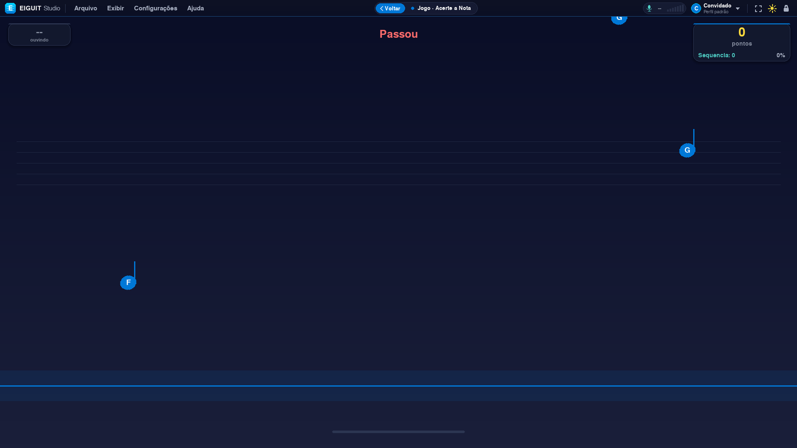
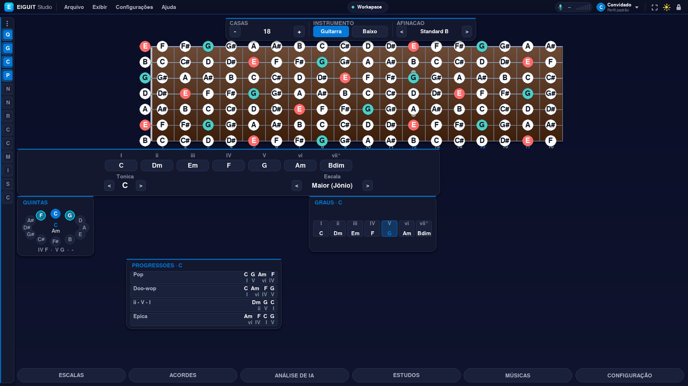
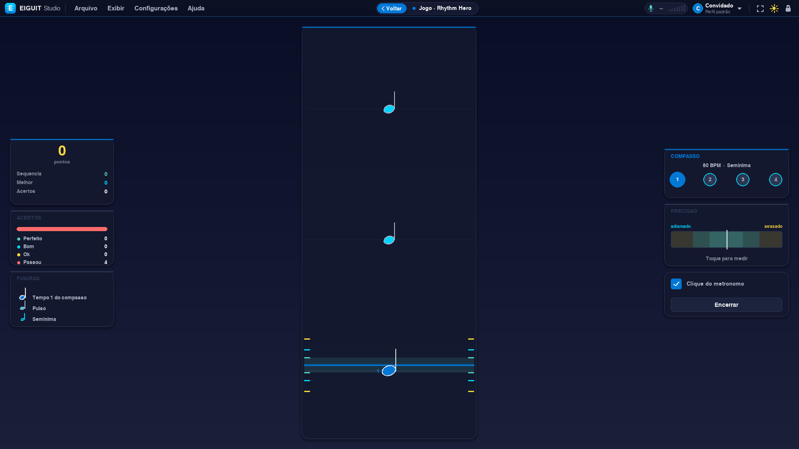
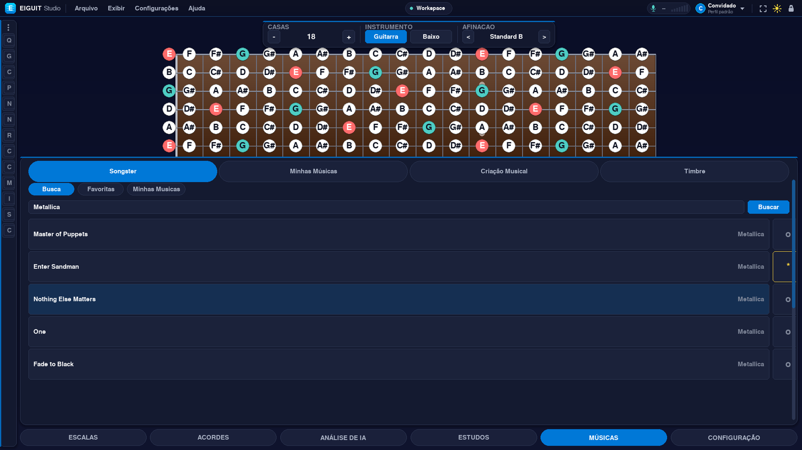
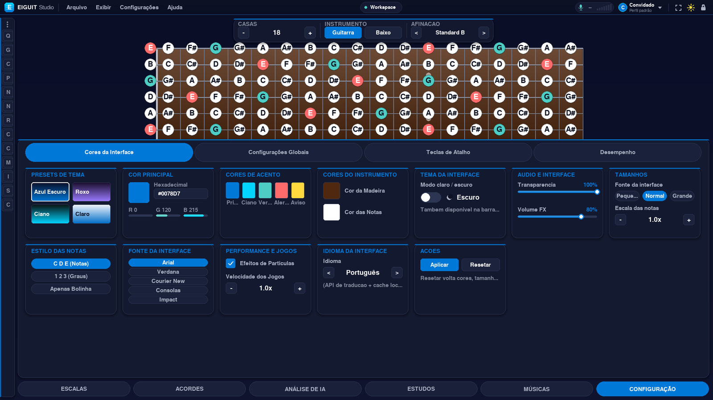

<div align="center">
  

  <h1>🎸 EIGUIT </h1>
  <p><i>Estúdio virtual de guitarra e baixo: braço interativo, campo harmônico, editor de tablatura, estúdio de estudos guiados, mini-jogos e processamento de áudio com IA</i></p>
  <p><i>Virtual guitar/bass studio: interactive fretboard, harmonic field, tablature editor, guided study tracks, mini-games and AI-assisted audio processing</i></p>

  <p>
    
    
  </p>
  <p>
    
    
  </p>

  <br>

  <p>
    
    
    
    
    
  </p>
</div>

> 📸 **Sobre os prints deste README:** as imagens acima e as da galeria mais abaixo são placeholders — os arquivos ainda não existem em `docs/screenshots/`. Basta salvar os prints do programa **com esses mesmos nomes de arquivo** nessa pasta (veja a lista completa na seção [Capturas de tela](#-capturas-de-tela--screenshots)) que eles aparecem automaticamente aqui e no GitHub, sem precisar editar este arquivo.

---

## 🇧🇷 Português

### ⚠️ Status do Projeto: Beta

O EIGUIT deixou de ser "só um braço de guitarra": depois de uma refatoração grande, o projeto virou um **estúdio completo**, organizado em camadas (`core/`, `ui/`, `audio/`, `Jogos/`, `DragDrop/`, `BD/`, `config/`) com um sistema de design próprio. A matemática musical, a renderização do braço, o DSP de áudio e o editor de tablatura já estão operacionais; a interface e os módulos mais novos (Estúdio de Estudos, editor de tablatura, busca de músicas/timbre, perfis na nuvem) ainda recebem ajustes visuais e de estabilidade com frequência.

**Procuramos colaboradores!**
* **Design (UI/UX):** refino visual, responsividade e microinterações do sistema de design próprio (`config/design_system.py`).
* **Desenvolvimento (Python/Pygame):** performance de renderização, novos módulos de `core/modulos/` e integração com o serviço de transcrição por IA.
* **Teoria musical:** novas trilhas em `Estudos/`, escalas exóticas, tétrades e progressões.
* **QA/Testes:** reportar bugs e sugerir melhorias — hoje o projeto não tem suíte de testes automatizada.

### 📝 Sobre o Projeto

O **Guitar Studio IA (EIGUIT)** é uma ferramenta interativa para guitarristas, baixistas, estudantes de teoria musical e produtores, escrita inteiramente em Python com Pygame. O núcleo é um loop de 60 FPS (`main.py`) que combina em tempo real:

* a visualização dinâmica do braço de **sete instrumentos diferentes** (não só guitarra);
* o **campo harmônico** e o **filtro de acordes** (o antigo "CAGED", hoje generalizado para tríades, tétradas, inversões, diminutos e suspensos);
* um **editor/tocador de tablatura** com sintetizador próprio;
* um **estúdio de estudos guiados** (nota, escala, acorde, ciclo de quintas, padrões, improviso e uma trilha de aulas);
* **mini-jogos** de precisão rítmica e auditiva;
* **processamento de áudio em tempo real** (afinador, detecção polifônica de notas, detector de ataque/palhetada);
* busca de **músicas** (Songsterr) e de **timbres/equipamento**, com favoritos salvos na nuvem;
* **login e perfis na nuvem** (PostgreSQL), para levar tema, cores, afinações e projetos salvos de um computador para o outro.

O diferencial didático continua sendo o **Filtro de Acordes automático**: ao selecionar um acorde gerado dinamicamente a partir do campo harmônico (Jônico, Dórico, Frígio, etc.), o software mapeia instantaneamente Tônica, Terça e Quinta (ou a tétrade completa) por toda a extensão do braço, aplicando transparência inteligente (*alpha blending*) às notas fora do acorde — o que facilita o estudo de arpejos e a memorização fotográfica das formas (*shapes*).

### 🚀 Funcionalidades

As funcionalidades abaixo estão organizadas por área. Itens marcados **(novo)** não existiam na versão anterior deste README; os demais foram mantidos e, na maioria dos casos, ampliados.

#### 🎸 Instrumento e braço
* **Multi-instrumento (novo):** guitarra de 6 e 7 cordas, baixo de 4 e 5 cordas, ukulele, cavaquinho e teclado — todos compartilham o mesmo motor de diagrama (`config/instrumentos.py`), então estudos, jogos e visualizações funcionam em qualquer um deles.
* **Braço interativo dinâmico:** recálculo automático de espaçamento por instrumento, com dezenas de afinações abertas (Drop A, Standard B, All 4ths, etc.) prontas para uso.
* **Câmera com pan & zoom (novo):** o workspace roda numa superfície virtual (`core/modulos/modulo_camera.py`) que pode ser arrastada e ampliada independentemente da barra superior fixa.
* **Sistema de "gaveteiro" (novo):** os painéis (escalas, acordes, sessão, etc.) vivem em gavetas que se abrem/fecham e se auto-organizam na tela (`ui/components/gaveteiro.py`), com apoio de *drag & drop* com guias de encaixe (*snap guides*, `DragDrop/`).

#### 🎵 Teoria musical
* **Campo harmônico inteligente:** os 7 graus da escala em algarismos romanos, recalculados em tempo real a partir da tônica selecionada.
* **Filtro de acordes ampliado (era só CAGED):** tríades, **tétrades**, **inversões**, **diminutos** e **suspensos** (`ui/blocks/painel_acordes.py`) — o antigo painel CAGED agora é um caso particular desse painel maior.
* **Banco de escalas amplo:** maior, menor, pentatônicas, blues, modos gregos, escalas exóticas, harmônica/menor melódica e teoria avançada (`core/modulos/modulos_*`), geradas dinamicamente por `ui/fabrica_escalas.py`.
* **Blocos extras de teoria (novo):** círculo das quintas/quartas, histórico de notas tocadas, drone de referência, notas por corda, capotraste virtual e progressões prontas — todos arrastáveis (`ui/components/blocos_extras.py`).
* **Graus vs. letras:** alterna a exibição das notas entre nomes absolutos (C D E) e graus (1 2 3) para focar em intervalos.

#### 🧑‍🏫 Estúdio de Estudos guiados (novo)
Um modo de prática dedicado (`Estudos/`, orquestrado por `core/modulos/modulos_estudos.py`), com sete frentes:
* **Notas** — adivinhar, mapear ou reconhecer de ouvido, em qualquer instrumento.
* **Escalas** — prática guiada pelas famílias de escalas do banco de dados musical.
* **Acordes** — reconhecimento e prática de tríades/tétrades comuns.
* **Ciclo de quintas/quartas** — roda interativa, montagem de progressões e modo desafio (relativa, armadura, quinta/quarta).
* **Padrões** — sequências melódicas (terças, quartas, arpejos) e células rítmicas clássicas, sincronizadas ao metrônomo.
* **Improvisação** — mostra, acorde a acorde, as notas alvo, as notas de passagem e as notas a evitar, junto com guias de fraseado.
* **Aulas** — trilha guiada do iniciante ao avançado que encadeia os motores de Padrões e Improvisação já pré-configurados, com progresso marcável.

#### 🎼 Editor e tocador de tablatura (novo)
* Editor de tablatura em grade (`ui/editor_musical.py`, `ui/renderizador_criador_tab.py`) com visão de **Tablatura** e **Partitura** sempre sincronizadas (a partitura é derivada da tablatura, não é um dado separado).
* Sintetizador próprio (`audio/tab_synth.py`) para tocar a tablatura criada, com técnicas marcadas na grade.
* Integração com o **gerenciador de dados de tablatura** (`core/modulos/modulo_dados_tab.py`) e leitura de arquivos **MIDI** (`core/modulos/leitor_midi.py` / `modulo_leitor_midi.py`).

#### 🎮 Mini-jogos
* **Acerte a Nota:** as notas descem numa pauta de 5 linhas com cabeça, haste e acidentes; a nota captada pelo microfone precisa bater com a figura ao cruzar a faixa de acerto. Em dificuldades mais altas também cobra o ataque no tempo certo. Quatro níveis: Fácil, Média, Difícil e Impossível.
* **Rhythm Hero (novo):** jogo de ritmo cujo acerto é medido pelo **ataque** do instrumento (não pelo sustain, então segurar uma nota não pontua). Cada acerto guarda o desvio em milissegundos até o tempo exato, exibido num medidor de precisão — mostra se você atrasa ou adianta o tempo.
* Presets rápidos de configuração (Iniciante, Prática, Desafio) e subdivisões rítmicas (semínima, colcheia, tercina, semicolcheia).

#### 🎚️ Áudio, IA e afinação
* **Processamento de áudio contínuo:** captura por microfone com detecção de frequência (`audio/global_audio.py`) e afinador visual com indicador de desvio em cents.
* **Detecção polifônica de notas (novo):** o motor de áudio global identifica mais de uma nota tocada ao mesmo tempo.
* **Detector de ataque/palhetada (novo, `core/modulos/detector_palhetadas.py`):** usado pelos jogos e estudos para julgar o tempo real da execução, não só a altura da nota.
* **Cliente de transcrição por IA (novo, `core/modulos/modulo_ia_transcricao.py`):** envia um áudio para o microsserviço de transcrição do repositório (FastAPI + Celery + Demucs + basic-pitch, fora do escopo deste README) e recebe notas/BPM de volta.
* **Metrônomo completo:** widget compacto no canto da tela ou painel completo, BPM de 40 a 300, presets rápidos e fórmulas de compasso (2/4, 3/4, 4/4, 6/8), com o primeiro tempo do compasso sempre destacado.

#### 🌐 Músicas, timbre e nuvem (novo)
* **Busca de músicas (Songsterr):** busca tablaturas por artista/música, baixa MIDI de referência e mantém uma lista de **favoritos sincronizada na nuvem**.
* **Minhas músicas:** biblioteca de arquivos MIDI adicionados localmente (também por *drag & drop* de um `.mid`).
* **Busca de timbre:** agrega, para "Artista - Música", quem já timbrou aquele som (fóruns, vídeos, presets) e sites/fontes institucionais, com um botão para copiar um prompt pronto para uma IA de texto.
* **Login e perfis na nuvem:** autenticação (`ui/tela_login.py`, CustomTkinter) contra um banco PostgreSQL na nuvem; tema, cores, afinação e projetos salvos ficam ligados à conta do usuário (`BD/gerenciador_remoto_db.py`, `core/modulos/modulo_perfil.py`).
* **Sessão de estudo:** contabiliza tempo de prática, notas tocadas e o percentual delas dentro do contexto harmônico ativo (`core/sessao_estudo.py`).

#### 🎨 Personalização e interface
* **Sistema de design próprio (novo, `config/design_system.py`):** paletas clara/escura consistentes, com alternância de tema em tempo real.
* **Cor de destaque customizável (novo):** além de 5 temas prontos, dá para digitar um hexadecimal exato ou escolher em um seletor de cor.
* **5 idiomas com tradução dinâmica (novo):** Português, English, Español, Français e Deutsch, traduzidos sob demanda e cacheados (`core/i18n.py`).
* **3 tamanhos de fonte** e 5 fontes de sistema, com reconstrução instantânea da UI ao trocar.
* **Modos de exibição de nota:** letras, graus ou "só a bolinha" (para focar no *shape*).
* **Suporte e tutoriais integrados:** modal com abas (Escalas, Configurações, Metrônomo, Acordes, Vídeos) e reprodução de vídeo-aulas embutida (`core/modulos/modulo_suporte.py`, `modulo_video_aula.py`).

### 🏗️ Arquitetura e Estrutura de Arquivos

A base de código foi refatorada em camadas. A estrutura abaixo reflete o repositório atual (o app desktop; o microsserviço de transcrição e o frontend web em `services/` e `web_frontend/` são programas separados no mesmo repositório e não estão detalhados aqui):

```text
EIGUIT/
├── main.py                       # Entry point / loop principal do motor (60 FPS)
├── studio_cli.py                 # CLI de teoria musical (TUI com "rich")
├── core/
│   ├── estado_app.py             # EstadoGlobal: fonte única de verdade do app
│   ├── controlador_eventos.py    # Único ponto de tratamento de mouse/teclado
│   ├── config.py                 # Preferências do usuário (cores, fontes, tema, idioma)
│   ├── i18n.py                   # Tradução dinâmica (5 idiomas) com cache
│   ├── sessao_estudo.py          # Rastreamento de tempo/precisão de prática
│   └── modulos/                  # Módulos de features (campo harmônico, metrônomo,
│                                  # processamento de áudio, timbre, songsterr, perfil,
│                                  # transcrição IA, dados de tablatura, câmera, etc.)
├── ui/
│   ├── renderizador_ui.py        # Todos os draw calls: workspace + UI fixa
│   ├── fabrica_escalas.py        # Gera os dicionários de escalas/modos
│   ├── editor_musical.py         # Editor de tablatura/partitura sincronizados
│   ├── tela_login.py             # Tela de autenticação (CustomTkinter)
│   ├── blocks/                   # Braço da guitarra, painel de acordes, tablatura
│   └── components/                # Barra superior, navegação inferior, gaveteiro,
│                                  # sidebar de áudio, blocos extras de teoria
├── Estudos/                       # As sete trilhas do Estúdio de Estudos
├── Jogos/                         # Acerte a Nota, Rhythm Hero e o gerenciador de jogos
├── DragDrop/                      # Elementos arrastáveis e guias de encaixe (snap)
├── audio/                         # Motor de áudio global (mic) e sintetizador de tablatura
├── BD/                            # Acesso ao PostgreSQL na nuvem (perfis, favoritos)
├── config/                        # Design system, instrumentos, layout, temas
└── assets/                        # Imagens, ícones, timbres e áudios do projeto
```

### 🛠️ Como Executar o Projeto

O projeto usa **Python 3.12** e é gerenciado com **[uv](https://docs.astral.sh/uv/)** (o `pyproject.toml`/`uv.lock` já fixam as versões das dependências).

1. **Pré-requisitos:** Python 3.12, `git` e `uv` instalados.
2. **Clone o repositório:**
   ```bash
   git clone https://github.com/SEU_USUARIO/EIGUIT.git
   cd EIGUIT
   ```
3. **Instale as dependências:**
   ```bash
   uv sync
   ```
4. **Execute a aplicação:**
   ```bash
   uv run python main.py
   ```
   *(ou ative o ambiente virtual criado pelo `uv` e rode `python main.py` normalmente).*

⚠️ **Importante:** o app abre primeiro uma **tela de login** e só continua depois de autenticar contra um banco PostgreSQL na nuvem — é preciso ter acesso a essa configuração (ou apontar `BD/gerenciador_remoto_db.py` para seu próprio banco) para o programa iniciar.

Também existe um executável standalone gerado com PyInstaller (`build/GuitarStudioIA/GuitarStudioIA.exe`); se preferir testar sem configurar o ambiente Python, gere ou baixe o `.zip` da build mais recente e mantenha a pasta `assets/` no mesmo diretório do `.exe`. Por não ter assinatura digital, o Windows SmartScreen pode alertar — clique em "Mais informações" → "Executar assim mesmo".

### 🎮 Guia de Uso Rápido

1. **Login:** autentique-se na tela inicial (CustomTkinter). Seu tema, cores e afinações favoritas ficam salvos na sua conta.
2. **Instrumento:** troque entre guitarra (6/7 cordas), baixo (4/5 cordas), ukulele, cavaquinho ou teclado nos controles de instrumento — o braço se redimensiona sozinho.
3. **Escalas e acordes:** abra a gaveta de Escalas ou Acordes na barra inferior, arraste uma forma para o braço; clique com o botão direito sobre o braço para devolver tudo ao painel de origem.
4. **Campo harmônico:** clique num grau (I, II, III...) para isolar as notas daquele acorde no braço, com transparência no restante da escala; clique de novo para desmarcar.
5. **Estúdio de Estudos:** abra a gaveta "Estudos" e escolha uma trilha (Notas, Escalas, Acordes, Ciclo de Quintas, Padrões, Improvisação ou Aulas).
6. **Editor de tablatura:** na gaveta "Músicas", vá em "Área de Música" → "Criar Tablatura" para abrir o editor/tocador.
7. **Mini-jogos:** na gaveta de Análise de IA/Jogos, escolha "Acerte a Nota" ou "Rhythm Hero" e toque fisicamente no seu instrumento — o jogo julga afinação e tempo.
8. **Busca de músicas e timbre:** na gaveta "Músicas", use "Busca" para procurar tablaturas no Songsterr (e favoritar), ou a aba de Timbre para pesquisar como outros músicos tocaram determinada música.
9. **Metrônomo:** widget compacto no canto inferior direito, ou o painel completo com BPM, compasso e presets.
10. **Personalização:** na aba Configurações, troque tema, cor de destaque (inclusive por hexadecimal), fonte, tamanho de fonte, idioma (5 opções) e o modo de exibição das notas (letras, graus ou só a bolinha).

### 📸 Capturas de tela / Screenshots

As imagens abaixo ainda são placeholders. Salve os prints do programa em `docs/screenshots/` **usando exatamente estes nomes de arquivo** para que apareçam automaticamente neste README (no GitHub e no editor local):

| Arquivo | O que deve mostrar |
|---|---|
| `docs/screenshots/login.png` | Tela de login/autenticação |
| `docs/screenshots/braco_guitarra.png` | Braço interativo com uma escala ativa |
| `docs/screenshots/campo_harmonico.png` | Painel de campo harmônico / filtro de acordes |
| `docs/screenshots/estudos.png` | Uma das trilhas do Estúdio de Estudos |
| `docs/screenshots/editor_tablatura.png` | Editor/tocador de tablatura |
| `docs/screenshots/jogo_acerte_a_nota.png` | Mini-jogo Acerte a Nota |
| `docs/screenshots/jogo_rhythm_hero.png` | Mini-jogo Rhythm Hero |
| `docs/screenshots/afinador_ia.png` | Painel de afinador / análise de IA |
| `docs/screenshots/musicas_busca.png` | Busca de músicas (Songsterr) |
| `docs/screenshots/configuracoes.png` | Painel de configurações / temas |

<p align="center">
  
  
</p>
<p align="center">
  
  
</p>

---

## 🇺🇸 English

### ⚠️ Project Status: Beta

EIGUIT outgrew being "just a fretboard viewer": after a large refactor, it's now a **full studio**, organized in layers (`core/`, `ui/`, `audio/`, `Jogos/`, `DragDrop/`, `BD/`, `config/`) with its own design system. The core musical math, fretboard rendering, audio DSP and tablature editor are fully operational; the newest modules (Study Studio, tablature editor, song/gear search, cloud profiles) still get frequent visual and stability refinements.

**Contributors wanted!**
* **Design (UI/UX):** visual polish, responsiveness and micro-interactions for the custom design system (`config/design_system.py`).
* **Development (Python/Pygame):** rendering performance, new modules under `core/modulos/`, and integration with the AI transcription service.
* **Music theory:** new tracks under `Estudos/`, exotic scales, tetrads and progressions.
* **QA/Testing:** bug reports and stability suggestions — there is currently no automated test suite.

### 📝 About the Project

**Guitar Studio IA (EIGUIT)** is an interactive tool for guitarists, bassists, music theory students and producers, written entirely in Python with Pygame. The core is a 60 FPS loop (`main.py`) that combines in real time:

* a dynamic fretboard/neck for **seven different instruments** (not just guitar);
* the **harmonic field** and **chord filter** (the former "CAGED", now generalized to triads, tetrads, inversions, diminished and suspended chords);
* a built-in **tablature editor/player** with its own synthesizer;
* a **guided Study Studio** (notes, scales, chords, circle of fifths, patterns, improvisation and a lesson track);
* **mini-games** for rhythmic and pitch accuracy;
* **real-time audio processing** (tuner, polyphonic note detection, pick/attack detection);
* **song search** (Songsterr) and **gear/tone search**, with cloud-synced favorites;
* **cloud login and profiles** (PostgreSQL), carrying theme, colors, tunings and saved projects between computers.

The educational centerpiece remains the **Automatic Chord Filter**: selecting a chord dynamically generated from the harmonic field (Ionian, Dorian, Phrygian, etc.) instantly maps the Root, Third and Fifth (or the full tetrad) across the entire fretboard, applying smart alpha-blending transparency to notes outside the chord — drastically simplifying arpeggio study and shape memorization.

### 🚀 Features

Grouped by area. Items marked **(new)** did not exist in the previous version of this README; everything else was kept and, in most cases, expanded.

#### 🎸 Instrument and fretboard
* **Multi-instrument (new):** 6- and 7-string guitar, 4- and 5-string bass, ukulele, cavaquinho and keyboard — all sharing the same diagram engine (`config/instrumentos.py`), so studies, games and visualizations work on any of them.
* **Dynamic interactive fretboard:** automatic spacing recalculation per instrument, with dozens of ready-to-use open tunings (Drop A, Standard B, All 4ths, etc.).
* **Pan & zoom camera (new):** the workspace renders onto a virtual surface (`core/modulos/modulo_camera.py`) that can be panned/zoomed independently of the fixed top bar.
* **"Drawer" system (new):** panels (scales, chords, session, etc.) live in drawers that open/close and self-arrange on screen (`ui/components/gaveteiro.py`), backed by drag & drop with snap guides (`DragDrop/`).

#### 🎵 Music theory
* **Smart harmonic field:** the 7 scale degrees in Roman numerals, recalculated live from the selected root.
* **Expanded chord filter (used to be just CAGED):** triads, **tetrads**, **inversions**, **diminished** and **suspended** chords (`ui/blocks/painel_acordes.py`) — the old CAGED panel is now a special case of this larger panel.
* **Large scale library:** major, minor, pentatonics, blues, Greek modes, exotic scales, harmonic/melodic minor and advanced theory (`core/modulos/modulos_*`), generated dynamically by `ui/fabrica_escalas.py`.
* **Extra theory blocks (new):** circle of fifths/fourths, played-note history, reference drone, notes-per-string, virtual capo and ready-made progressions — all draggable (`ui/components/blocos_extras.py`).
* **Degrees vs. letters:** toggle note display between absolute names (C D E) and degrees (1 2 3) to focus on intervals.

#### 🧑‍🏫 Guided Study Studio (new)
A dedicated practice mode (`Estudos/`, orchestrated by `core/modulos/modulos_estudos.py`) with seven tracks:
* **Notes** — guess, map or ear-train, on any instrument.
* **Scales** — guided practice through the scale library.
* **Chords** — recognition and practice of common triads/tetrads.
* **Circle of fifths/fourths** — interactive wheel, progression building and a challenge mode (relative key, key signature, fifth/fourth).
* **Patterns** — melodic sequences (thirds, fourths, arpeggios) and classic rhythmic cells, synced to the metronome.
* **Improvisation** — shows, chord by chord, target notes, passing scale notes and notes to avoid, plus phrasing guides.
* **Lessons** — a guided beginner-to-advanced track that opens the Patterns/Improvisation engines already pre-configured, with completion tracking.

#### 🎼 Tablature editor and player (new)
* Grid-based tablature editor (`ui/editor_musical.py`, `ui/renderizador_criador_tab.py`) with always-in-sync **Tablature** and **Sheet Music** views (sheet music is derived from the tab grid, not stored separately).
* Its own synthesizer (`audio/tab_synth.py`) to play back the created tablature, including grid-marked techniques.
* Integrates with the **tablature data manager** (`core/modulos/modulo_dados_tab.py`) and **MIDI** file reading (`core/modulos/leitor_midi.py` / `modulo_leitor_midi.py`).

#### 🎮 Mini-games
* **Hit the Note:** notes fall on a 5-line staff with noteheads, stems and accidentals; the note detected by the microphone must match the figure as it crosses the hit zone. Higher difficulties also require hitting the attack on time. Four levels: Easy, Medium, Hard and Impossible.
* **Rhythm Hero (new):** a rhythm game where hits are judged by the instrument's **attack** (not sustain, so holding a note earns nothing). Every hit stores its deviation in milliseconds from the exact beat, shown on a precision meter — revealing whether you rush or drag.
* Quick setup presets (Beginner, Practice, Challenge) and rhythmic subdivisions (quarter, eighth, triplet, sixteenth notes).

#### 🎚️ Audio, AI and tuning
* **Continuous audio processing:** microphone capture with frequency detection (`audio/global_audio.py`) and a visual tuner with cents-deviation feedback.
* **Polyphonic note detection (new):** the global audio engine identifies more than one note played at once.
* **Pick/attack detector (new, `core/modulos/detector_palhetadas.py`):** used by games and studies to judge real playing timing, not just pitch.
* **AI transcription client (new, `core/modulos/modulo_ia_transcricao.py`):** sends audio to the repository's transcription microservice (FastAPI + Celery + Demucs + basic-pitch, out of scope for this README) and gets notes/BPM back.
* **Full metronome:** compact widget in the corner or a full panel, 40–300 BPM, quick presets and time signatures (2/4, 3/4, 4/4, 6/8), always accenting the downbeat.

#### 🌐 Songs, gear and cloud (new)
* **Song search (Songsterr):** search tabs by artist/song, download reference MIDI, and keep a **cloud-synced favorites** list.
* **My Songs:** a library of locally added MIDI files (also via drag & drop of a `.mid`).
* **Gear/tone search:** for "Artist - Song", aggregates who already dialed in that tone (forums, videos, presets) and official sites/sources, with a button to copy a ready-made prompt for a text AI.
* **Cloud login and profiles:** authentication (`ui/tela_login.py`, CustomTkinter) against a cloud PostgreSQL database; theme, colors, tuning and saved projects are tied to the user's account (`BD/gerenciador_remoto_db.py`, `core/modulos/modulo_perfil.py`).
* **Study session tracking:** tracks practice time, notes played and how many of them fall inside the active harmonic context (`core/sessao_estudo.py`).

#### 🎨 Customization and interface
* **Custom design system (new, `config/design_system.py`):** consistent light/dark palettes with live theme switching.
* **Custom accent color (new):** besides 5 ready-made themes, type an exact hex color or pick one from a color picker.
* **5 languages with dynamic translation (new):** Portuguese, English, Spanish, French and German, translated on demand and cached (`core/i18n.py`).
* **3 font sizes** and 5 system fonts, with instant UI rebuild on change.
* **Note display modes:** letters, degrees, or "dot only" (to focus on the shape).
* **Built-in support and tutorials:** a tabbed modal (Scales, Settings, Metronome, Chords, Videos) with embedded video-lesson playback (`core/modulos/modulo_suporte.py`, `modulo_video_aula.py`).

### 🏗️ Architecture and File Structure

The codebase was refactored into layers. The tree below reflects the current repository (the desktop app; the transcription microservice and web frontend under `services/` and `web_frontend/` are separate programs in the same repo and are out of scope here):

```text
EIGUIT/
├── main.py                       # Entry point / main engine loop (60 FPS)
├── studio_cli.py                 # Music-theory CLI (rich TUI)
├── core/
│   ├── estado_app.py             # EstadoGlobal: the single source of truth
│   ├── controlador_eventos.py    # The only mouse/keyboard input handler
│   ├── config.py                 # User preferences (colors, fonts, theme, language)
│   ├── i18n.py                   # Dynamic translation (5 languages) with caching
│   ├── sessao_estudo.py          # Practice time/accuracy tracking
│   └── modulos/                  # Feature modules (harmonic field, metronome,
│                                  # audio processing, gear search, Songsterr, profile,
│                                  # AI transcription, tab data, camera, etc.)
├── ui/
│   ├── renderizador_ui.py        # All draw calls: workspace + fixed UI
│   ├── fabrica_escalas.py        # Generates the scale/mode dictionaries
│   ├── editor_musical.py         # Synced tablature/sheet-music editor
│   ├── tela_login.py             # Authentication screen (CustomTkinter)
│   ├── blocks/                   # Fretboard, chord panel, tablature block
│   └── components/                # Top bar, bottom navigation, drawer system,
│                                  # audio sidebar, extra theory blocks
├── Estudos/                       # The seven Study Studio tracks
├── Jogos/                         # Hit the Note, Rhythm Hero and the games manager
├── DragDrop/                      # Draggable elements and snap guides
├── audio/                         # Global (mic) audio engine and tab synthesizer
├── BD/                            # Cloud PostgreSQL access (profiles, favorites)
├── config/                        # Design system, instruments, layout, themes
└── assets/                        # Project images, icons, timbres and audio
```

### 🛠️ How to Run the Project

The project targets **Python 3.12** and is managed with **[uv](https://docs.astral.sh/uv/)** (`pyproject.toml`/`uv.lock` pin the dependency versions).

1. **Prerequisites:** Python 3.12, `git` and `uv` installed.
2. **Clone the repository:**
   ```bash
   git clone https://github.com/YOUR_USER/EIGUIT.git
   cd EIGUIT
   ```
3. **Install dependencies:**
   ```bash
   uv sync
   ```
4. **Run the app:**
   ```bash
   uv run python main.py
   ```
   *(or activate the venv `uv` created and run `python main.py` directly).*

⚠️ **Important:** the app opens a **login screen** first and only continues after authenticating against a cloud PostgreSQL database — you need access to that configuration (or to point `BD/gerenciador_remoto_db.py` at your own database) for the program to start.

A standalone PyInstaller-built executable also exists (`build/GuitarStudioIA/GuitarStudioIA.exe`); if you'd rather test it without a Python setup, build or download the latest `.zip` and keep the `assets/` folder next to the `.exe`. Since it isn't digitally signed, Windows SmartScreen may warn you — click "More info" → "Run anyway".

### 🎮 Quick Start Guide

1. **Login:** authenticate on the startup screen (CustomTkinter). Your theme, colors and favorite tunings are saved to your account.
2. **Instrument:** switch between guitar (6/7 strings), bass (4/5 strings), ukulele, cavaquinho or keyboard in the instrument controls — the fretboard resizes itself.
3. **Scales and chords:** open the Scales or Chords drawer in the bottom bar and drag a shape onto the fretboard; right-click the fretboard to send everything back to its panel.
4. **Harmonic field:** click a degree (I, II, III...) to isolate that chord's notes on the fretboard, dimming the rest of the scale; click again to clear it.
5. **Study Studio:** open the "Estudos" drawer and pick a track (Notes, Scales, Chords, Circle of Fifths, Patterns, Improvisation or Lessons).
6. **Tablature editor:** in the "Músicas" drawer, go to "Music Area" → "Create Tablature" to open the editor/player.
7. **Mini-games:** in the AI Analysis/Games drawer, pick "Hit the Note" or "Rhythm Hero" and physically play your instrument — the game judges pitch and timing.
8. **Song and gear search:** in the "Músicas" drawer, use "Search" to look up tabs on Songsterr (and favorite them), or the Gear tab to see how other musicians got a particular tone.
9. **Metronome:** a compact widget in the bottom-right corner, or the full panel with BPM, time signature and presets.
10. **Customization:** in Settings, change theme, accent color (including by hex code), font, font size, language (5 options) and note display mode (letters, degrees, or dot only).

### 📸 Screenshots

The images below are still placeholders. Save the program's screenshots into `docs/screenshots/` **using these exact file names** so they show up automatically here (on GitHub and in your local editor) — see the table in the [Capturas de tela](#-capturas-de-tela--screenshots) section above for the full list and what each one should show.

---

## ⚖️ Termos de Uso e Licença Comercial / Terms of Use & Commercial License

**© 2026 Guitar Studio IA - MATHEUS ABELARDO TREVENZOLI ARAUJO. Todos os Direitos Reservados / All Rights Reserved.**

Este documento estabelece as regras estritas de utilização para o código-fonte, algoritmos de renderização, matemática de interface e ativos visuais presentes neste repositório.

1. **PROPRIEDADE INTELECTUAL:** Todo o código-fonte e algoritmos contidos neste repositório são de propriedade intelectual exclusiva do autor.
2. **USO PERMITIDO (CÓDIGO ABERTO):** É concedida permissão para clonar, baixar, compilar e executar este software **exclusivamente para fins educacionais, acadêmicos, estudo de código e uso recreativo/pessoal.** Contribuições via *Pull Requests* para melhoria do repositório original são bem-vindas e incentivadas.
3. **RESTRIÇÕES DE USO (NÃO COMERCIAL E SEM DERIVADOS):**
   * É expressamente **PROIBIDA** a venda, comercialização, aluguel, assinatura ou monetização direta/indireta deste software, bem como a integração do seu código em softwares pagos ou de terceiros.
   * É expressamente **PROIBIDA** a criação e distribuição pública de produtos derivados (*forks* que alterem a marca para se passarem por outro produto) com intenções de lucro ou sem a devida atribuição.
   * A cópia e redistribuição em massa deste software em plataformas externas sem os créditos originais, links para este repositório do GitHub e a manutenção desta licença anexada resultará em violação de direitos autorais.
4. **GARANTIA LIMITADA:** O software é fornecido "no estado em que se encontra" (*as is*), sem garantias de comercialização, funcionalidade livre de falhas ou adequação a propósitos específicos. O autor não se responsabiliza por danos lógicos ou problemas de processamento de áudio derivados do uso deste código.

---
*Desenvolvido com dedicação, lógica e muito ☕ para músicos que buscam a verdadeira evolução. / Engineered with logic, dedication, and ☕ for musicians pursuing true evolution.*
